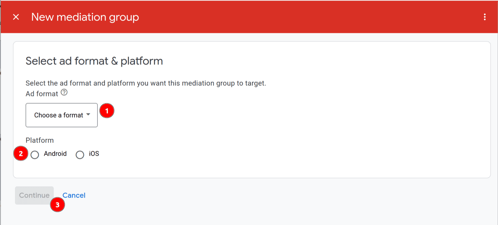
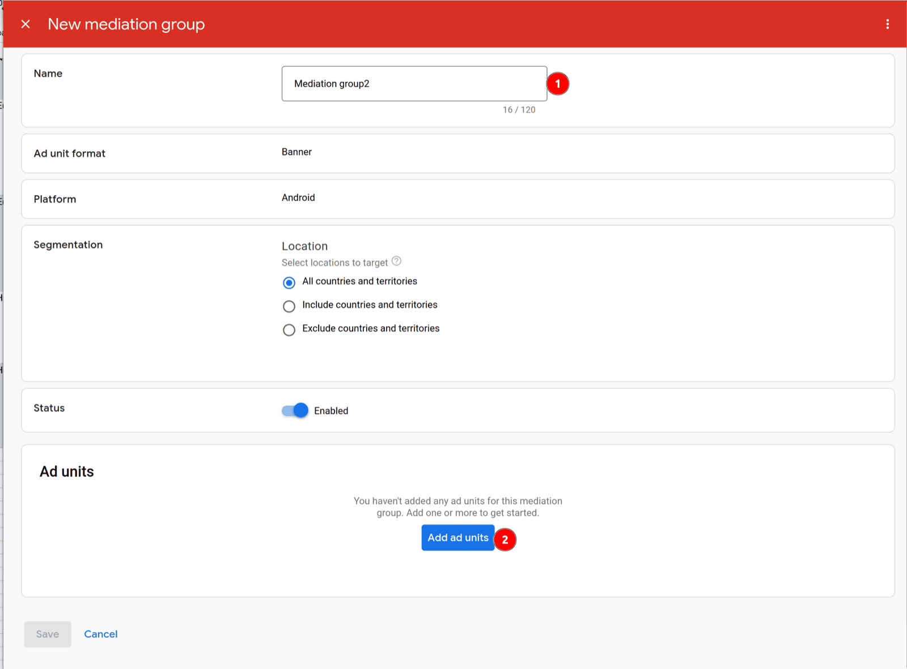
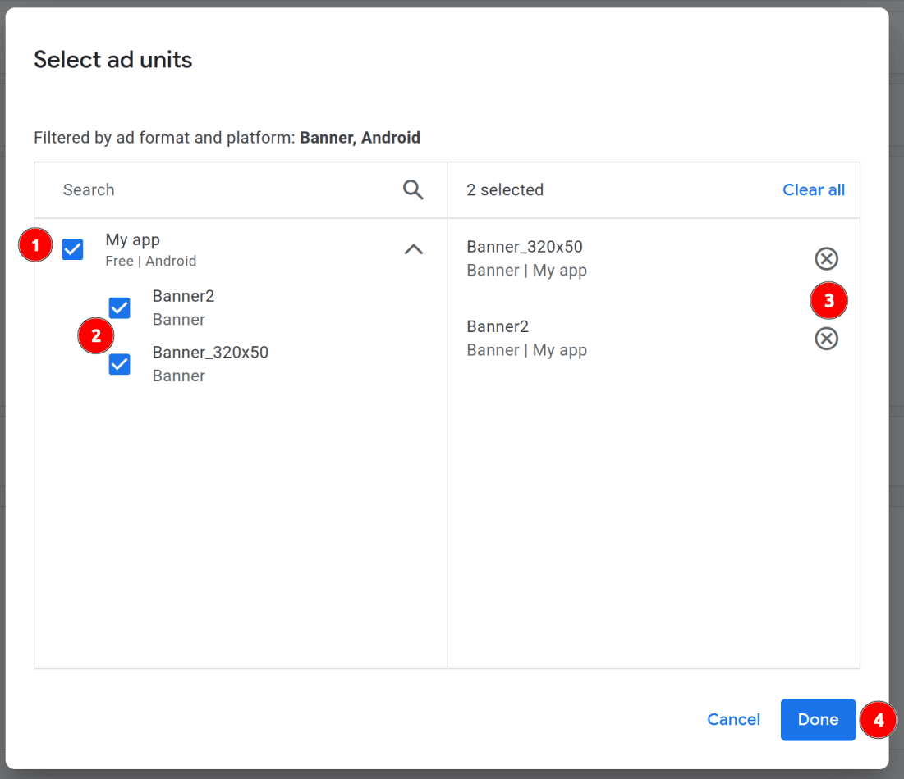
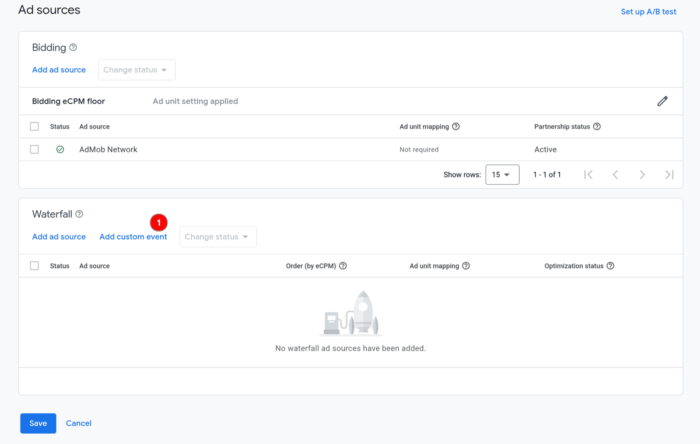
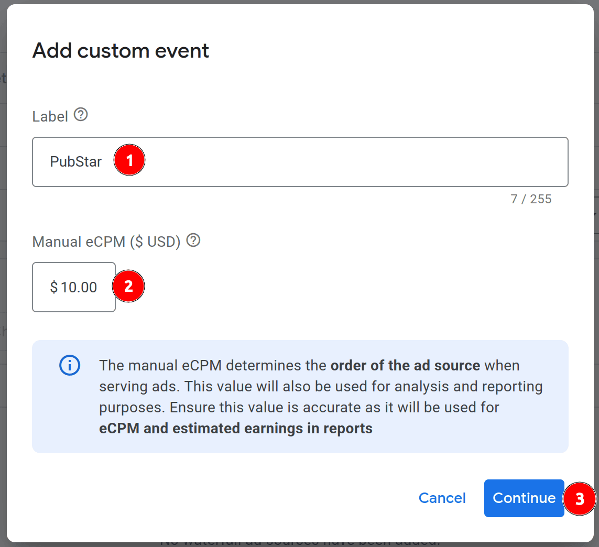
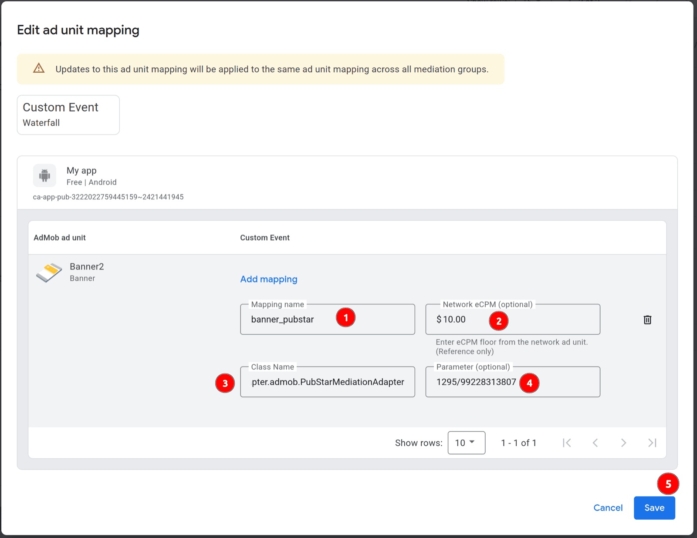
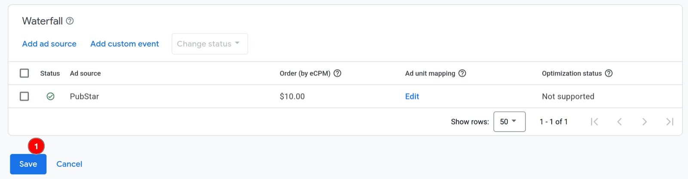

# AdMob Mediation Integration

This guide explains how to connect **PubStar** to **Google AdMob Mediation** on Android using custom events. It assumes your app is already set up with AdMob and you know how mediation works.

> **Before you use this guide — AdMob must already be integrated in your app**
>
> PubStar runs _inside_ AdMob's mediation waterfall. Your development team should complete standard AdMob integration first (SDK, App ID, ad units, and test ads). Only then add PubStar dependencies and configure custom events as described below.
>
> **Official AdMob integration guides (Android):**
> - [Get started with AdMob (Google Mobile Ads SDK)](https://developers.google.com/admob/android/quick-start)
> - [AdMob Mediation overview](https://developers.google.com/admob/android/mediation)
>
> PubStar app setup (SDK + App ID): [PubStar Android SDK — Integration](integration.md)

**Recommended order:**

1. Integrate AdMob in the Android app and confirm test ads load from AdMob ad units.
2. Add PubStar SDK, AdMob adapter, and `io.pubstar.key` (sections below).
3. Create mediation groups and PubStar custom events in the AdMob console.

## Requirements

- Android >= 23
- AdMob account with your app registered and **Google Mobile Ads SDK** already working in the app
- AdMob **ad units** created for each format (Banner, Interstitial, Native, Rewarded, App Open, etc.)
- A [PubStar App ID](https://pubstar.io/) from the PubStar Dashboard
- Placement keys from PubStar for each ad format you monetize

## Installation

Setting repository.

```bash
repositories {
  mavenCentral()
}
```

Dependency.

```bash
implementation 'io.pubstar.mobile:ads:1.6.+'
```

### AdMob mediation adapter (required)

To serve PubStar demand through AdMob custom events, add the AdMob mediation adapter alongside the core PubStar SDK:

```bash
implementation 'io.pubstar.mediation.adapter.admob:ads:1.6.+'
```

## Configuration

### 1. Update your AndroidManifest

Please refer to the [AndroidManifest.xml Configuration Guide](integration.md#1-update-your-androidmanifest) to set up your PubStar App ID.

### 2. Consent (GDPR / UMP) — gather before init

For users in regions that require consent (EEA, UK, etc.), you **must gather consent before initializing** the SDK. PubStar uses Google's **User Messaging Platform (UMP)**. If consent has not been resolved, `init(...)` does not start and reports `ErrorCode.CONSENT_NOT_SETTING` (`-10`) in `onError`.

Correct order: **`gatherConsent(...)` → then `init(...)` inside the completion callback.**

```kotlin
PubStarAdManager.gatherConsent(
    this, // Activity
    object : GoogleMobileAdsConsentManager.OnConsentGatheringCompleteListener {
        override fun consentGatheringComplete(error: FormError?) {
            // error is null on success; the consent form (if required) has already been shown.
            // Initialize PubStar only after consent has been gathered.
            PubStarAdManager.getInstance()
                .setInitAdListener(object : InitAdListener {
                    override fun onDone() {
                        // ready to load and show ads
                    }

                    override fun onError(code: ErrorCode) {
                        // init error
                    }
                })
                .init(this@YourActivity)
        }
    }
)
```

- `gatherConsent(...)` requests the latest consent info and automatically shows the consent form if required, then calls `consentGatheringComplete`.
- Call this from an **Activity** (the consent form is a UI dialog), typically on your splash/loading screen.
- The callback's `FormError?` is `com.google.android.ump.FormError`. UMP ships with the Google Mobile Ads SDK that PubStar already uses. If your app doesn't otherwise depend on GMA and the `FormError` import can't be resolved, add the UMP dependency:
  ```kotlin
  implementation("com.google.android.ump:user-messaging-platform:3.1.0")
  ```

> Outside consent-required regions, `canRequestAds()` is already true, so you can call `init(...)` directly — but routing every launch through `gatherConsent(...)` first is safe everywhere and avoids `CONSENT_NOT_SETTING`.

---

## AdMob mediation setup

After your app includes the SDK, adapter, and manifest key, configure AdMob so the waterfall can call PubStar. Use the **Class Name** and **Parameter** values below.

### Overview

1. Create a mediation group per ad format.
2. Attach the correct Android ad units.
3. Add custom events with PubStar's class name and your placement key.
4. Test on a device with a build that includes PubStar `1.6.+`.

### Mediation group setup

#### Step 1: Create Mediation Group

In your AdMob account go to `Mediation` and click `Create Mediation Group`:

<figure>
  
  <figcaption>Create Mediation Group.</figcaption>
</figure>

Choose one of the ad formats:

- Banner
- Interstitial
- Native Advanced
- Rewarded
- App Open

Choose platform **Android**.

Press **CONTINUE**. Then set the name for the mediation group and other properties:

<figure>
  
  <figcaption>Mediation group properties.</figcaption>
</figure>

Press **ADD AD UNITS** and select the target ad units in the dialog:

<figure>
  
  <figcaption>Add ad units.</figcaption>
</figure>

Press **DONE** and move to the next step.

#### Step 2: Add Custom Events

Add custom events for each PubStar line item you need in the waterfall (for example by eCPM floor).

<figure>
  
  <figcaption>Add ad sources.</figcaption>
</figure>

Press **ADD CUSTOM EVENT**:

<figure>
  
  <figcaption>Label and eCPM.</figcaption>
</figure>

Set the `Label` and `eCPM` for the custom event. Press **CONTINUE**.

The fields in this dialog are critical for proper integration:

- **Class Name** — use PubStar's AdMob adapter for all formats:

  ```
  io.pubstar.mediation.adapter.admob.PubStarMediationAdapter
  ```

- **Parameter** — enter your PubStar placement key as plain text (recommended). For **testing** with `io.pubstar.key` set to `pub-app-id-1233`, use the test placement keys below (one per mediation group format). In production, use the placement keys from your PubStar Dashboard.
  - Banner — `1233/99228313580`
  - Interstitial — `1233/99228313582`
  - Rewarded — `1233/99228313584`
  - App Open — `1233/99228313583`

<figure>
  
  <figcaption>Class Name and Parameter.</figcaption>
</figure>

Use the placement key for **this ad format** only. A native key must not be used in a banner mediation group.

Press **DONE** and repeat for additional custom events if needed.

<figure>
  
  <figcaption>Custom events list.</figcaption>
</figure>

Once you add all needed custom events, press **DONE** on the mediation group. The group is ready to serve PubStar demand to your app.

### Supported ad formats

One class name is used for every format. Match the Parameter value to the mediation group format.

| AdMob format | Test Parameter (placement key) |
| ------------ | ------------------------------ |
| Banner       | `1233/99228313580`             |
| Interstitial | `1233/99228313582`             |
| Rewarded     | `1233/99228313584`             |
| App Open     | `1233/99228313583`             |

Test keys pair with App ID `pub-app-id-1233`. Replace them with production placement keys before you ship. **Native Advanced** is not listed: native mediation only works with a **real native placement key** from your PubStar Dashboard (test native keys are not supported).

### Validation checklist

- `implementation 'io.pubstar.mobile:ads:1.6.+'` and AdMob adapter `1.6.+` are in your app.
- `io.pubstar.key` in AndroidManifest uses your real PubStar App ID.
- Class Name is exactly `io.pubstar.mediation.adapter.admob.PubStarMediationAdapter`.
- Parameter contains the correct placement key for that format.
- Mediation group platform is Android and format matches the ad unit.

### Troubleshooting

**Just finished setup — no requests yet** — After you save the mediation group in AdMob, it can take about **10–15 minutes** before AdMob starts routing ad requests to your PubStar custom events. Wait before retesting; use a fresh app session on a real device after that window.

**No fill** — Confirm placement key and format with PubStar support; verify the ad unit is linked to the mediation group.

**Custom event not called** — Check waterfall eCPM order; another network may win first.

**Parameter errors** — Parameter must not be empty; use your placement key as plain text (for testing other formats, banner example: `1233/99228313580`).

**Native Advanced not loading / no fill** — PubStar native in AdMob mediation **only works with a real native placement key** from your PubStar Dashboard for this app. Do **not** use shared test native keys (for example `1233/99228313581` with `pub-app-id-1233`); they will not serve. Create or copy your production native placement key, set it as the custom event **Parameter**, and confirm the mediation group format is Native Advanced.
