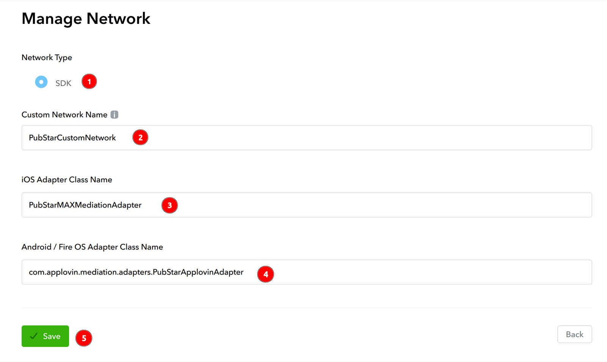
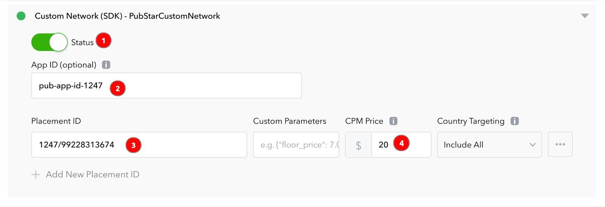

# AppLovin MAX Mediation Integration

This guide explains how to connect **PubStar** to **AppLovin MAX** on Android using a custom SDK network and waterfall placements. It follows the same console flow as [Prebid's MAX line item setup](https://docs.prebid.org/adops/mobile-rendering-max-line-item-setup.html), adapted for PubStar placement keys.

> **Before you use this guide — MAX must already be integrated in your app**
>
> PubStar runs _inside_ MAX's mediation waterfall. Your development team should complete standard MAX integration first (SDK, SDK key, ad units, and test ads). Only then add PubStar dependencies and configure the custom network as described below.
>
> **Official MAX integration guides (Android):**
> - [MAX SDK integration (Android)](https://developers.applovin.com/en/max/android/overview/integration/)
> - [MAX Mediation overview](https://developers.applovin.com/en/max/android/overview/mediation/)
>
> PubStar app setup (SDK + App ID): [PubStar Android SDK — Integration](integration.md)

**Recommended order:**

1. Integrate MAX in the Android app and confirm test ads load from MAX ad units.
2. Add PubStar SDK, MAX adapter, and `io.pubstar.key` (sections below).
3. Create the PubStar custom network and add placements to each MAX ad unit.

## Requirements

- Android >= 23
- AppLovin MAX account with your app registered and **MAX SDK** already working in the app
- MAX **ad units** created for each supported format (Banner, Interstitial, Native, Rewarded)
- A [PubStar App ID](https://pubstar.io/) from the PubStar Dashboard
- Placement keys from PubStar for each ad format you monetize

## Installation

Setting repository.

```bash
repositories {
  mavenCentral()
}
```

Dependency.

```bash
implementation 'io.pubstar.mobile:ads:1.6.+'
```

### MAX mediation adapter (required)

To serve PubStar demand through MAX custom network placements, add the AppLovin MAX adapter alongside the core PubStar SDK:

```bash
implementation 'io.pubstar.mediation.adapter.applovin:ads:1.6.+'
```

## Configuration

### 1. Update your AndroidManifest

Please refer to the [AndroidManifest.xml Configuration Guide](integration.md#1-update-your-androidmanifest) to set up your PubStar App ID.

---

## MAX mediation setup

After your app includes the SDK, adapter, and manifest key, configure MAX so the waterfall can call PubStar. Use the **Android Adapter Class Name** and **Placement ID** values below.

### Overview

1. Create an SDK custom network with PubStar's adapter class name.
2. For each MAX ad unit, enable the PubStar custom network and add one or more placements (by CPM).
3. Set each placement's **Placement ID** to your PubStar placement key (plain text).
4. Test on a physical device with a build that includes PubStar `1.6.+`.

### Custom network setup

#### Step 1: Add Custom Network

In your MAX account go to `Mediation` → `Manage` → `Networks` and click `Click here to add a Custom Network`.

<figure>
  
  <figcaption>Create custom network in MAX.</figcaption>
</figure>

Create an **SDK** custom network with these settings:

- **Network Type** — `SDK`
- **Custom Network Name** — any label you prefer (for example `PubStar`)
- **Android Adapter Class Name** — enter exactly:

  ```
  com.applovin.mediation.adapters.PubStarApplovinAdapter
  ```

Save the custom network.

#### Step 2: Add placements to ad units

Open or create a MAX ad unit. In `Custom Networks & Deals`, select the PubStar custom network you created in Step 1. Set the status to **Active** and add placements for your waterfall (one row per CPM tier, following your price granularity plan).

<figure>
  
  <figcaption>Add custom network placements to MAX ad unit.</figcaption>
</figure>

For each placement row, configure:

- **App ID** — enter your PubStar App ID from the [PubStar Dashboard](https://pubstar.io/) (the same value as `io.pubstar.key` in your AndroidManifest). For example:

  ```
  pub-app-id-1233
  ```

- **Placement ID** — your PubStar placement key as plain text (recommended). For **testing** with App ID `pub-app-id-1233`, use the test placement keys below (one per MAX ad unit format). In production, use the placement keys from your PubStar Dashboard.
  - Banner — `1233/99228313580`
  - Interstitial — `1233/99228313582`
  - Rewarded — `1233/99228313584`

  MAX passes this value to PubStar as the ad placement identifier. Do not reuse a native key on a banner ad unit.

- **CPM / Bid floor** — set according to your waterfall strategy so PubStar can compete at the intended price tier.

PubStar does **not** require Prebid-style `Custom Parameters` (for example `{"hb_pb":"0.10"}`). If your MAX UI shows an optional Custom Parameters field, you may leave it empty unless PubStar support instructs otherwise.

Repeat for every MAX ad unit and format you want PubStar to fill.

### Supported ad formats

One adapter class is used for every format below. Match the placement key to the MAX ad unit format. **App Open is not supported on MAX** — use AdMob mediation (or another supported channel) if you need PubStar app open ads.

| MAX ad unit format | Test Placement ID  |
| ------------------ | ------------------ |
| Banner             | `1233/99228313580` |
| Interstitial       | `1233/99228313582` |
| Rewarded           | `1233/99228313584` |

Test IDs pair with App ID `pub-app-id-1233`. Replace them with production placement keys before you ship. **Native** is not listed: native mediation only works with a **real native placement key** from your PubStar Dashboard (test native keys are not supported).

### Validation checklist

- `implementation 'io.pubstar.mobile:ads:1.6.+'` and MAX adapter `1.6.+` are in your app.
- `io.pubstar.key` in AndroidManifest uses your real PubStar App ID.
- Android Adapter Class Name is exactly `com.applovin.mediation.adapters.PubStarApplovinAdapter`.
- App ID on each placement matches your PubStar App ID (for example `pub-app-id-1233`).
- Each placement's Placement ID is the correct PubStar placement key for that format.
- PubStar custom network is **Active** on the target MAX ad units.
- Test on a **physical device**; raise PubStar CPM during testing if another network always wins.

### Troubleshooting

**Just finished setup — no requests yet** — After you save custom network and ad unit settings in MAX, it can take about **30–60 minutes** before MAX applies the changes and starts routing requests to your PubStar placements. Wait before retesting; use a fresh app session on a real device after that window.

**Custom network never called** — Confirm adapter class name spelling, disable MAX Test Mode if it bypasses custom networks, verify app package name and MAX SDK key match the dashboard, and test on a physical device. Temporarily set a high CPM on PubStar placements so they can win the waterfall.

**No fill** — Confirm placement key and format with PubStar support; verify the placement is active on the correct ad unit.

**Placement ID errors** — Placement ID must not be empty; use your placement key as plain text (for testing other formats, banner example: `1233/99228313580`).

**Native not loading / no fill** — PubStar native in MAX mediation **only works with a real native placement key** from your PubStar Dashboard for this app. Do **not** use shared test native keys (for example `1233/99228313581` with `pub-app-id-1233`); they will not serve. Use your dashboard native placement ID on the native MAX ad unit only.
